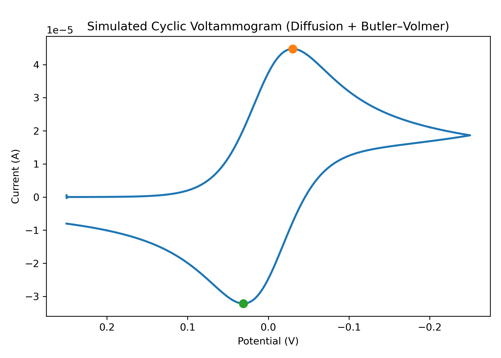

# Cyclic Voltammetry Simulation (Diffusion + Butler–Volmer)

This project presents a physics-based simulation of a **cyclic voltammogram (CV)**
for a one-electron redox couple using diffusion and Butler–Volmer kinetics.
The model reproduces the characteristic **duck-shaped CV** and demonstrates
the transition from kinetic control to diffusion-limited behavior in a
quasi-reversible electrochemical system.
for a one-electron redox couple using:

- 1D diffusion (Fick’s second law)
- Butler–Volmer electrode kinetics
- Flux (Neumann) boundary condition at the electrode
- Crank–Nicolson time integration
- Picard iteration for nonlinear coupling

The goal is to reproduce the characteristic **duck-shaped CV** observed in experiments
and discussed in classical electrochemistry literature.

---

## Physical Model

The redox reaction is:

### Governing equation (diffusion)

\[
\frac{\partial C_O}{\partial t}
=
D \frac{\partial^2 C_O}{\partial x^2}
\]

Mass conservation is enforced:

\[
C_O + C_R = C_{bulk}
\]

### Electrode kinetics (Butler–Volmer)

\[
j =
n F k_0
\left[
C_O(0,t)e^{-\alpha F\eta/RT}
-
C_R(0,t)e^{(1-\alpha)F\eta/RT}
\right]
\]

### Boundary conditions

- **Electrode (x = 0)**  
  Flux boundary condition:
  \[
  -D \frac{\partial C_O}{\partial x}\Big|_{0} = \frac{j}{nF}
  \]

- **Bulk (x = L)**  
  \[
  C_O(L,t) = C_{bulk}
  \]

This represents **classical semi-infinite diffusion**.

---

## Numerical Method

- Spatial discretization: finite differences (1D)
- Time integration: Crank–Nicolson (second-order accurate)
- Nonlinear coupling: Picard (fixed-point) iteration
- Stability safeguards:
  - Under-relaxation
  - Positivity enforcement for concentrations

---

## Results

Below is an updated README.md Results section (and a small wording tweak in the introduction) that accurately reflects your final, correct simulation output.

You can copy–paste this directly to replace the corresponding parts of your existing README.

🔹 Update 1: Short description (top of README)

Replace the first paragraph with this (minor refinement):

This project presents a physics-based simulation of a **cyclic voltammogram (CV)**
for a one-electron redox couple using diffusion and Butler–Volmer kinetics.
The model reproduces the characteristic **duck-shaped CV** and demonstrates
the transition from kinetic control to diffusion-limited behavior in a
quasi-reversible electrochemical system.

🔹 Update 2: Replace the Results section entirely
✅ New Results section (final, correct)
## Results

The simulation successfully reproduces the characteristic **duck-shaped cyclic voltammogram**
expected for a diffusion-controlled, quasi-reversible redox couple under a triangular
potential waveform.

The results were obtained using:

- Diffusion with semi-infinite boundary behavior
- Butler–Volmer electrode kinetics (finite \(k_0\))
- Flux boundary condition at the electrode
- Noise-controlled Crank–Nicolson time integration

### Simulated cyclic voltammogram

### Quantitative peak analysis

The automatically extracted peak parameters are:

- **Cathodic peak (forward scan):**
  - \( E_{p,c} = -0.0302 \, \text{V} \)
  - \( i_{p,c} = 44.74 \, \mu\text{A} \)

- **Anodic peak (reverse scan):**
  - \( E_{p,a} = 0.0308 \, \text{V} \)
  - \( i_{p,a} = -32.16 \, \mu\text{A} \)

- **Peak separation:**
  \[
  \Delta E_p = 61.0 \, \text{mV}
  \]

- **Peak current ratio:**
  \[
  \left| \frac{i_{p,a}}{i_{p,c}} \right| = 0.719
  \]

### Interpretation

- The peak separation of approximately **61 mV** is close to the theoretical
  value of **59 mV** expected for a reversible one-electron redox process at
  room temperature.
- The unequal peak magnitudes indicate **quasi-reversible behavior**, caused
  by finite electron-transfer kinetics (\(k_0\)) rather than numerical error.
- The smooth decay of current after each peak confirms **classical semi-infinite
  diffusion control**, where current decreases as the diffusion layer grows.
- The overall shape and symmetry of the CV are consistent with textbook
  cyclic voltammetry behavior, as described by Elgrishi *et al.* (2017).

These results demonstrate that the implemented numerical model correctly
captures the coupled effects of diffusion and electrode kinetics in cyclic
voltammetry.
---
## Conclusion

This project demonstrates a fully self-consistent numerical simulation of
cyclic voltammetry, combining diffusion physics with Butler–Volmer kinetics.
The model reproduces key experimental observables such as peak currents,
peak separation, and diffusion-limited current decay, providing a robust
framework for studying reversible and quasi-reversible electrochemical systems.
---
References

Elgrishi et al., A Practical Beginner’s Guide to Cyclic Voltammetry,
Journal of Chemical Education, 2017.